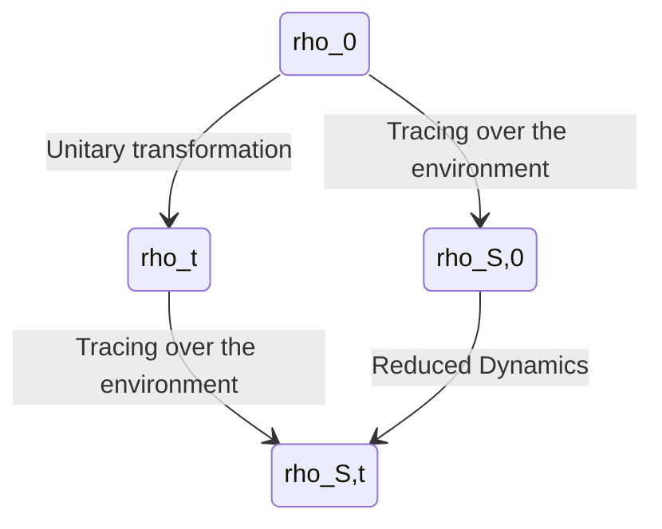

---
tags:
  - "#quantum-theory"
---
Reduced Dynamics are an approximation of the evolution of a [[quantum system]], where we have applied the [[📘 Partial Trace]] over the environment.

More formally, this is a [[📘 Quantum Dynamical Semigroup]] $\{T_t \}_{t \geq 0}$ that attempts to make the diagram below commutative. This is only an attempt, as the [[📘 Reduced system]] does not contain all the information needed for commutativity to hold.

Where we use the notation:
- $\rho_0$ for the initial [[📘 Statistical Operator|Density Matrix]] of the full system
- $\rho_t := U_t\rho_0U_t^\dagger$ for the evolving [[📘 Statistical Operator|Density Matrix]] of the full system.
- $\rho_{S,0}:= \mathrm{Tr}^E[\rho_0]$ for the initial [[📘 Statistical Operator|Density Matrix]] of the [[📘 Reduced system]].
- $\rho_{S,t} := \mathrm{Tr}^E[\rho_t]$ for the evolving [[📘 Statistical Operator|Density Matrix]] of the [[📘 Reduced system]].
