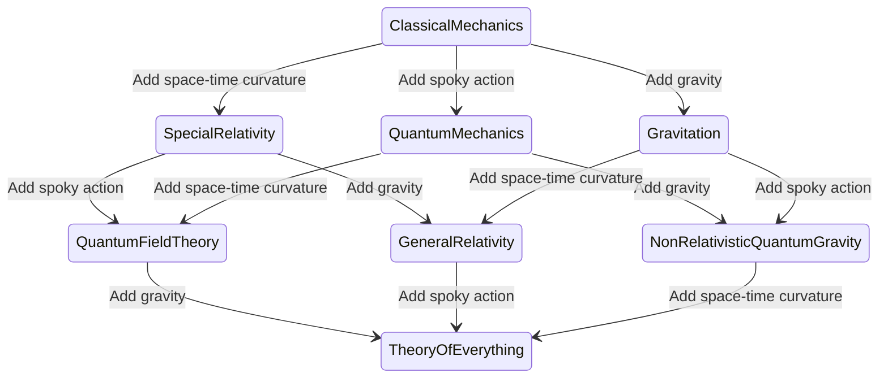

Quantum Field Theory joins the ideas behind [[quantum theory]] and [[special relativity]]. There are multiple field theories that apply to different forces:

| Theory | Force |
| ---- | ---- |
| QED: [[Quantum Electrodynamics]] | [[Electromagnetic force]] |
| QCD: [[Quantum Chromodynamics]] | [[Strong nuclear force]] |
| [[Electroweak Theory]] | [[Weak nuclear force]] |

There is yet to be found a [[quantum theory of gravity]]. A good overview over attempts made to unify physical theories is provided by the cGh cube, seen in the diagram below:

