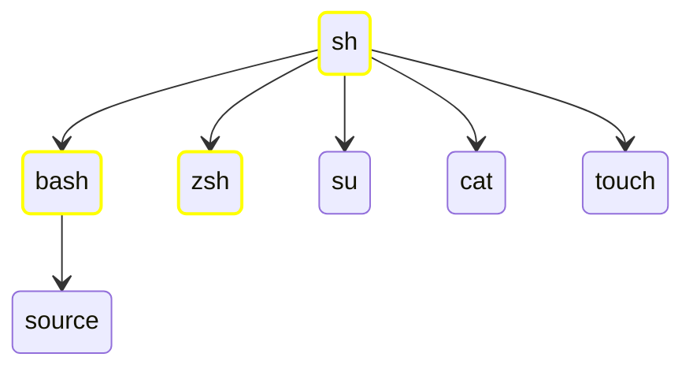

---
tags:
  - "#diagram"
---
Originally we had the Bourne shell ( `sh` ), which later originated the Bourne Again shell ( `bash` ) , Z Shell ( `zsh` ) and others.
Some commands are specific to the shell being used. In the diagram below we make shell specific commands explicit.

