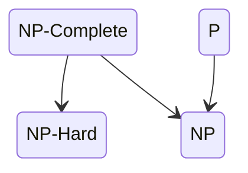

---
tags:
  - "#coding"
  - "#diagram"
---
The diagram below describes inclusion relations between the time complexity of algorithms

Relevant groups include:
- [[NP-Complete]]
- [[NP-Hard]]
- [[P]]
- [[NP]]
- [[EQP]] ( Exact Quantum Polynomial )
- [[BQP]] ( Bounded error Quantum Polynomial )
- [[BPP]] ( Bounded error classical polynomial )

