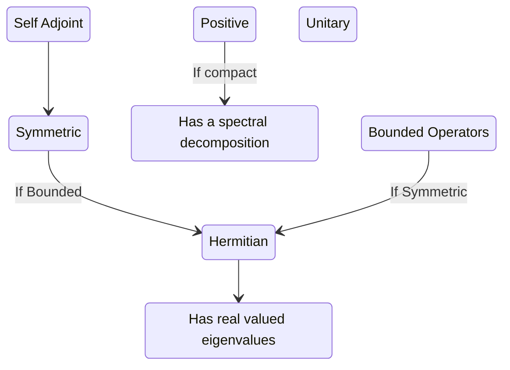

A linear operator is a map $\Omega: V \rightarrow V$  satisfying

1. $\Omega a\ket{V}= a \Omega \ket{V}$
2. $\Omega ( a\ket{V} + b \ket{W} ) = a \Omega \ket{V} + b \Omega \ket{W}$ 
3. $\bra{V} a \Omega = \bra{V} \Omega a$ 
4. $( \bra{V} a + \bra{W} b ) \Omega = a \bra{V} \Omega + b \bra{W} \Omega$ 

In the above:
- $V,W$ are [[vector]]s
- $a,b$ are [[scalar]]s in a [[field]]
- $\bra{\cdot}$ and $\ket{\cdot}$ follow the [[braket notation]]

[[📘 Operator]]s are a generalisation of matrices: They act on [[📘 Vector Space]]s linearly, without being attached to any specific [[basis]]. When working with finite [[📘 Vector Space]]s, the choice of a [[basis]] allows us to represent the [[📘 Operator]] as a matrix. This won't be always possible: operators in infinite dimensional spaces do not always have a matrix representation

# Relations

The diagram below aims to make relations between [[📘 Operator]]s and their matrix representation memorable. An arrow means an implication. I need to improve on this diagram. [[Help me ❓]]

See more details on:
- [[📘 Adjoint Operator]]
- [[📘 Hermitian Operator]]
- [[📘 Anti-Hermitian Operator]]
- [[📘 Self-Adjoint Operator]]
- [[📘 Unitary Operator]]
- [[📘 Symmetric Operator]]
- [[📘 Involuntory Operator]]
- [[📘 Compact Operator]]

# Properties
- [[📗 All operators can be decomposed into hermitian and anti-hermitian components]]
- [[📗 In finite dimensional spaces, hermitian = symmetric = self-adjoint]]
