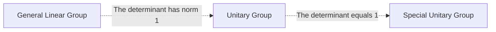

A gauge theory is a type of field theory in which the Lagrangian, and hence the dynamics of the system itself, do not change under local transformations according to certain smooth families of operations (Lie groups).

# Group relations

- General Linear Group $GL(n)$ : Invertible matrices $A$
- Unitary Group $U(n)$ : Unitary matrices $U: \| \det U \| = 1$  
- Special Unitary Group $SU(n)$ : Unitary matrices $U: \det U = 1$ 

