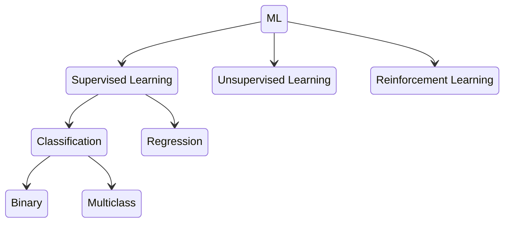

---
tags:
  - "#machine-learning"
  - "#diagram"
---
The diagram below summarises relations between different types of ML

```mermaid
stateDiagram
	SL : Supervised Learning
	UL : Unsupervised Learning
	RL : Reinforcement Learning

	classDef shell stroke-width:2px,stroke:yellow;
	
	class sh shell
	class bash shell
	class zsh shell
	class fish shell
		
	ML --> SL
	ML --> UL
	ML --> RL

	SL --> Classification
	SL --> Regression

	Classification --> Binary
	Classification --> Multiclass
```
