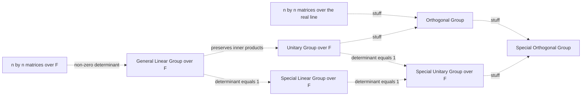
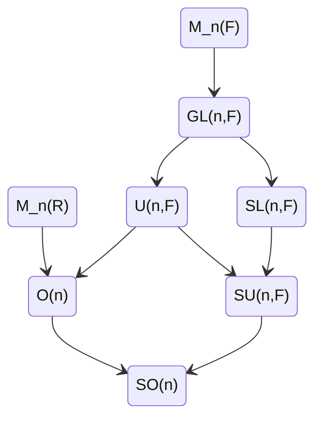

---
tags:
  - "#group-theory"
  - "#diagram"
---
The table below summarises the relations between frequently used groups

Where, up to LaTeX formatting, we have the following groups:
- $\mathbb{F}$ is a [[field]]
- $\mathbb{R}$ is the [[real line]]
- $M_n(\mathbb{F})$ is the set of $n \times n$ matrices over $\mathbb{F}$ 
- $M_n(\mathbb{R})$ is  the set of $n \times n$ matrices over $\mathbb{R}$ 
- $GL(n, \mathbb{F})$ is the [[General Linear Group]]
- $SL(n, \mathbb{F})$ is the [[Special Linear Group]]
- $U(n, \mathbb{F})$ is the [[Unitary Group]]
- $SU(n, \mathbb{F})$ is the [[Special Unitary Group]]
- $O(n)$ is the [[Orthogonal Group]]
- $SO(n)$ is the [[Special Orthogonal Group]]